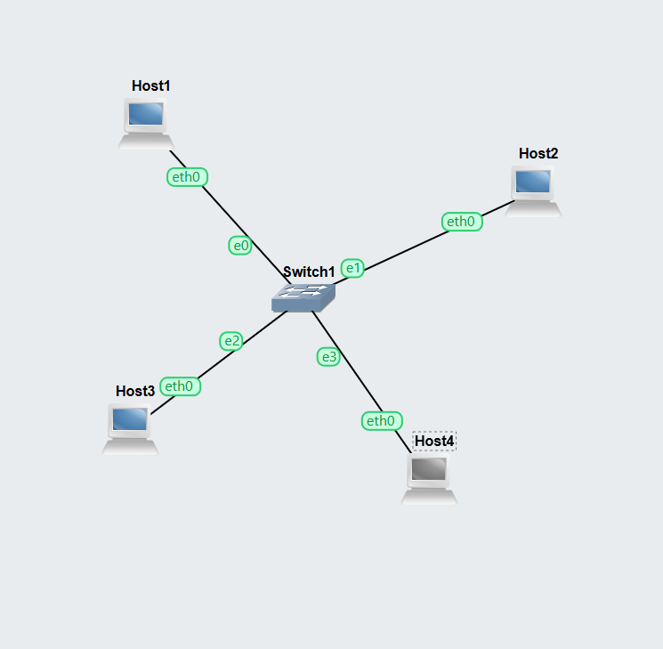
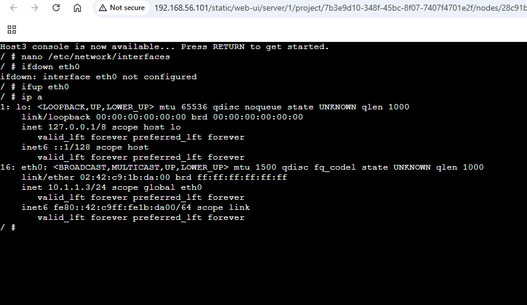
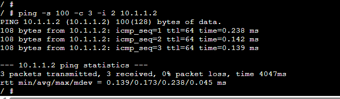

# COIT20261 Portfolio – Week 02

**Student Name:** Sandip Sapkota  
**Student ID:** 12320934  
**Week:** 02


# Objective

The aim of this week's tutorial was to learn different methods of configuring static IP addresses on Linux hosts using GNS3 and to test network connectivity using the ping command.


# Task 1 – Setting Static IP Addresses

## Activities Completed

- Created a GNS3 project named `Setting-IP-12320934`.
- Added four Linux Host nodes and one Ethernet switch.
- Connected all hosts to the same LAN.
- Configured static IP addresses using three different methods:
  1. GNS3 Configure menu
  2. Editing `/etc/network/interfaces`
  3. Using the `ip address add` command

## IP Address Configuration

| Host | Configuration Method | IP Address |
|------|----------------------|------------|
| Host1 | GNS3 Configure | 10.1.1.1/24 |
| Host2 | GNS3 Configure | 10.1.1.2/24 |
| Host3 | /etc/network/interfaces | 10.1.1.3/24 |
| Host4 | ip address add | 10.1.1.4/24 |

## Commands Used

### Configure using interfaces file

```bash
nano /etc/network/interfaces
ifdown eth0
ifup eth0
```

### Configure using ip command

```bash
ip address add 10.1.1.4/24 dev eth0
```

### Verify IP address

```bash
ip address show
```

# Evidence
- 






# Task 2 – Ping Testing

## Activities Completed

- Verified communication between hosts using `ping`.
- Tested continuous ping.
- Tested ping with a limited count.
- Observed RTT (Round Trip Time).
- Confirmed successful communication with 0% packet loss.

---

## Commands Used

```bash
ping 10.1.1.2
```

```bash
ping -c 3 10.1.1.2
```

---

# Ping Results

| Test | Result |
|------|--------|
| Host1 → Host2 | Successful |
| Packet Loss | 0% |
| RTT | Approximately 0.19 ms |

---

# Reflection

This week's tutorial helped me understand multiple methods of assigning static IP addresses to Linux hosts. I learned that configuring the IP address through the GNS3 Configure menu stores the configuration before the node starts, while editing the `/etc/network/interfaces` file requires restarting the interface using `ifdown` and `ifup`. I also learned that using the `ip address add` command applies the IP address immediately, but the configuration is temporary and will not persist after a reboot.

Using the `ping` command allowed me to verify network connectivity between hosts and measure the round-trip time (RTT). The results showed successful communication with 0% packet loss, confirming that the network was configured correctly.

---

# Challenges

- Understanding the differences between permanent and temporary IP configuration.
- Remembering to reload the network interface after editing the interfaces file.
- Learning different `ping` command options.

---

# Learning Outcomes

After completing this tutorial I can:

- Configure static IP addresses using three different methods.
- Verify IP addresses using `ip address show`.
- Test connectivity using `ping`.
- Interpret packet loss and RTT values.
- Troubleshoot basic network connectivity issues.

