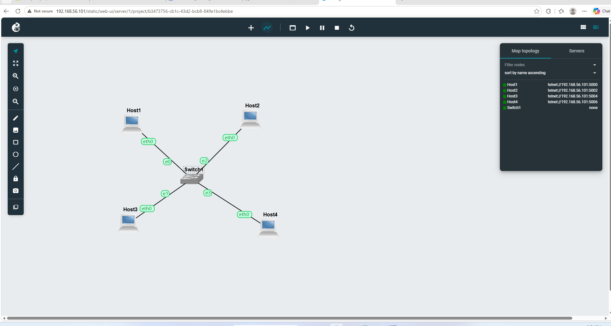
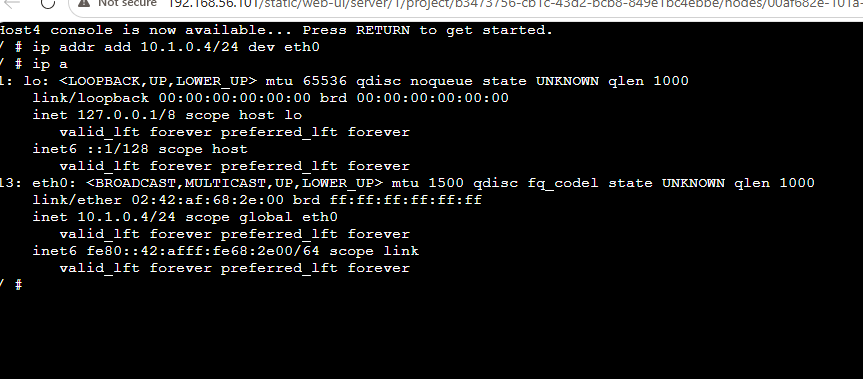
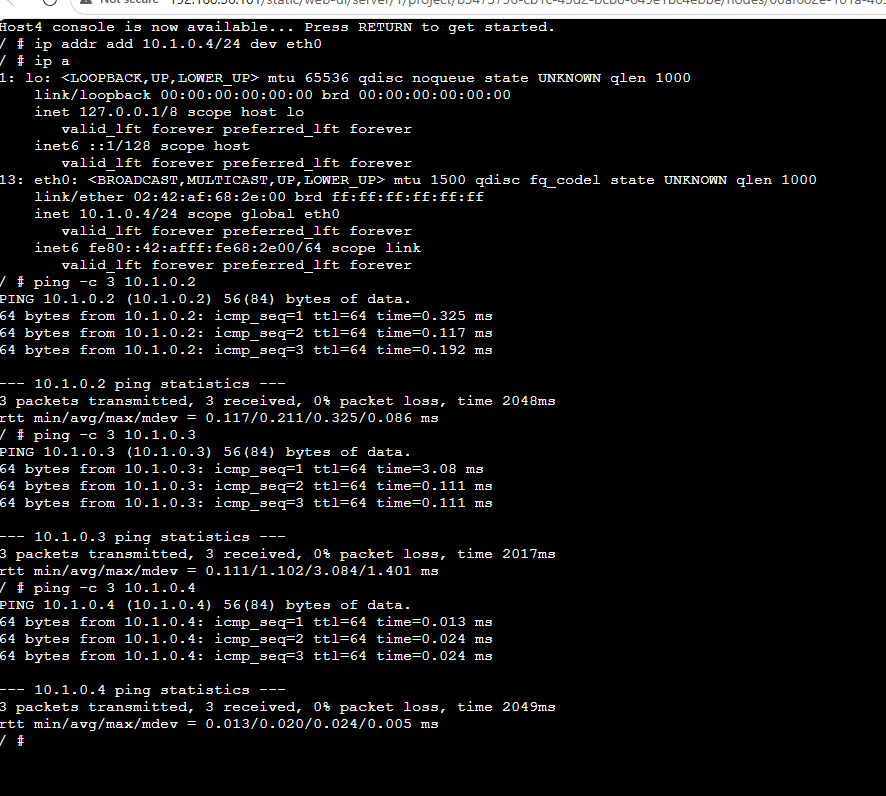
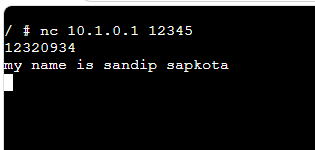
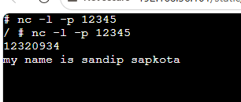
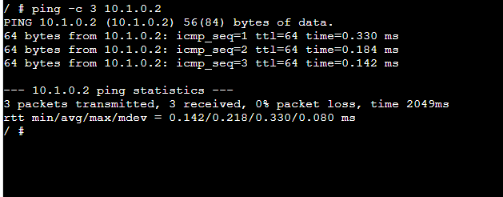
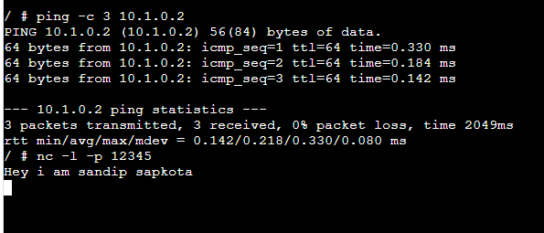
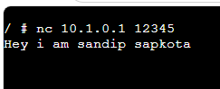
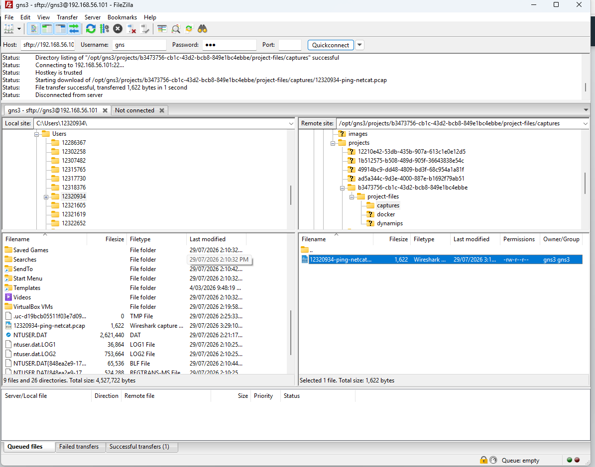

# COIT20261 Portfolio – Week 03

**Student Name:** Sandip Sapkota  
**Student ID:** 12320934  
**Week:** 03

---

# Objective

The objective of this tutorial was to learn how to use Netcat (nc) for simple client-server communication between Linux hosts and to capture network traffic in GNS3 for later analysis.

---

# Task 1 – Netcat Communication

## Activities Completed

- Used the existing `Setting-IP-12320934` project.
- Started a Netcat server on one Linux host.
- Connected a Netcat client from another Linux host.
- Sent my name from the client to the server.
- Sent my student ID from the server to the client.
- Verified successful communication between the client and server.

---

## Commands Used

### Netcat Server

```bash
nc -l -p 12345
```

### Netcat Client

```bash
nc 10.1.0.1 12345
```

---

# Task 2 – Packet Capture

## Activities Completed

- Started packet capture on the link between Host A and the Ethernet switch.
- Sent three ICMP Echo Request packets using the `ping` command.
- Sent a message using Netcat while the capture was running.
- Stopped the packet capture.
- Transferred the packet capture file from the GNS3 server to the Windows computer using FileZilla.

---

## Commands Used

### Ping

```bash
ping -c 3 10.1.0.2
```

### Netcat

```bash
nc 10.1.0.1 12345
```

---

# Evidence

### Screenshot 1



---

### Screenshot 2


---

### Screenshot 3


---

### Screenshot 4


---

### Screenshot 5


---

### Screenshot 6


---

### Screenshot 7


---

### Screenshot 8


---

### Screenshot 9 


    
---
## Packet Capture File

The packet capture file generated during this tutorial is available below.

- [12320934-ping-netcat.pcap](12320934-ping-netcat.pcap)

# Testing Results

| Test | Result |
|------|--------|
| Netcat server started successfully | ✅ Pass |
| Netcat client connected successfully | ✅ Pass |
| Messages exchanged successfully | ✅ Pass |
| Ping test completed successfully | ✅ Pass |
| Packet capture completed successfully | ✅ Pass |
| PCAP file transferred successfully | ✅ Pass |

---

# Reflection

This tutorial introduced the use of Netcat for application-layer communication between Linux hosts. I learned how to configure one host as a server and another as a client to exchange messages over a TCP connection.

I also learned how to capture network traffic in GNS3 and transfer the packet capture file to my Windows computer using FileZilla. These activities improved my understanding of basic network communication and packet capture, which will be useful for analysing network traffic in later tutorials using Wireshark.

---

# Learning Outcomes

After completing this tutorial, I can:

- Configure and use Netcat as both a server and a client.
- Exchange messages between Linux hosts.
- Test connectivity using the `ping` command.
- Capture packets in GNS3.
- Transfer `.pcap` files from the GNS3 server to a Windows computer.
- Prepare packet capture files for analysis in Wireshark.
