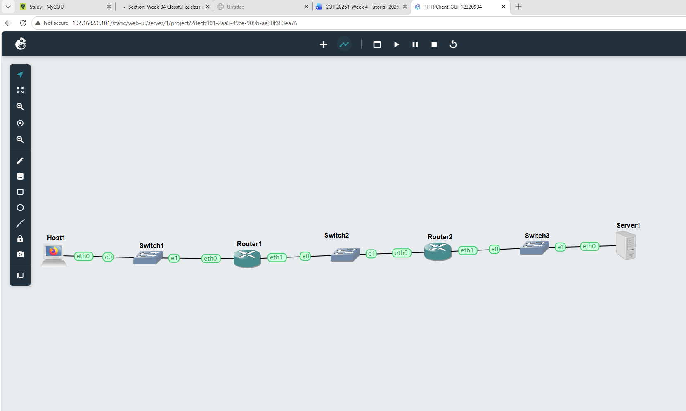
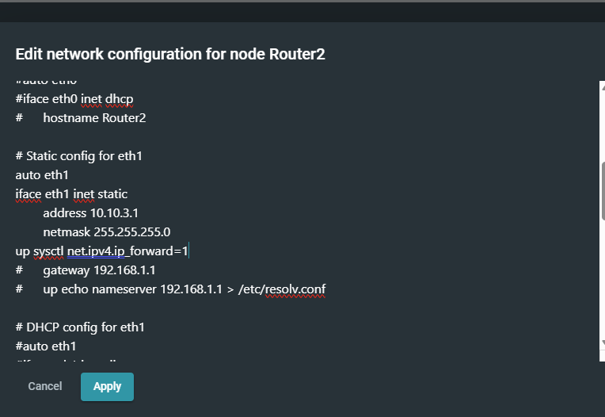
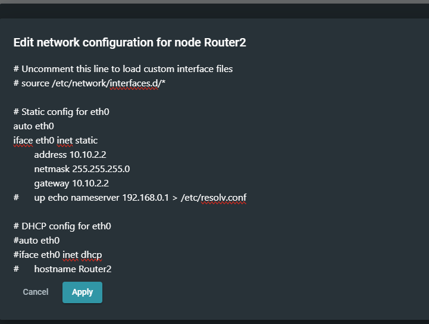
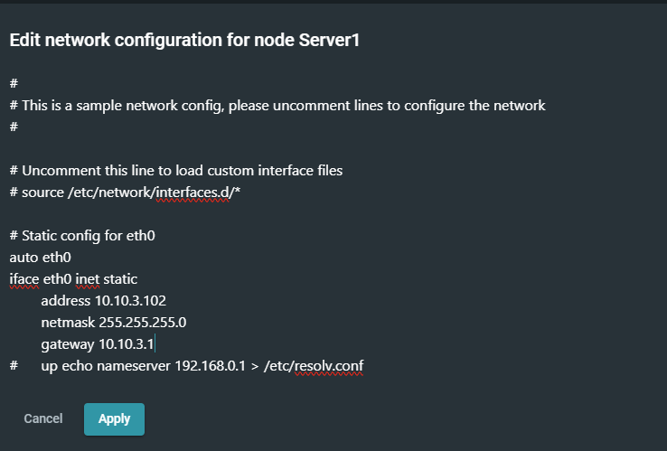
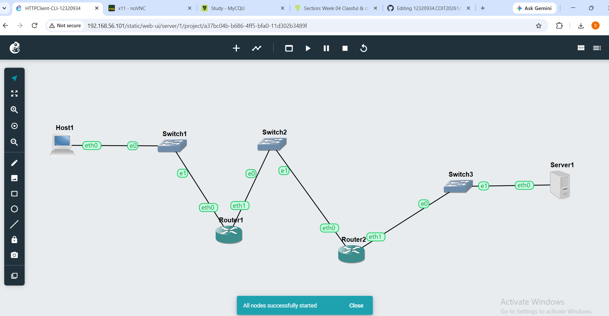
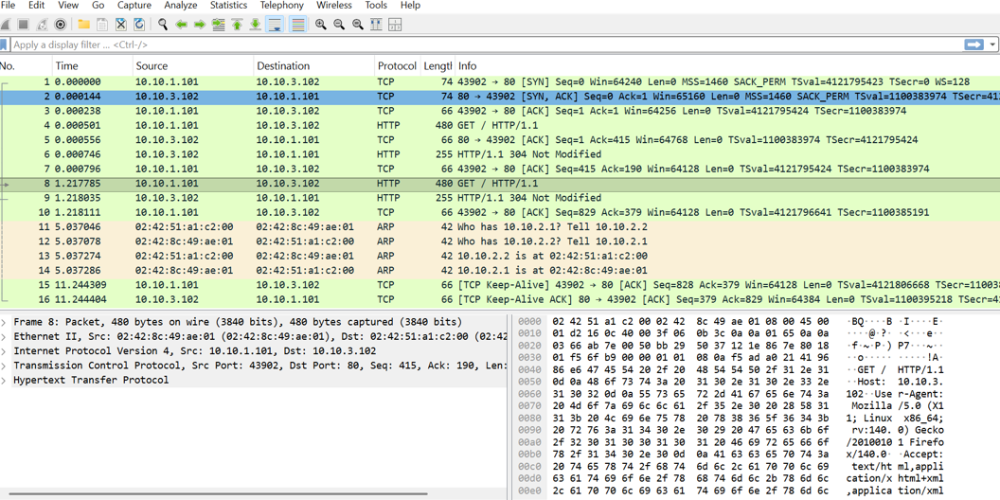
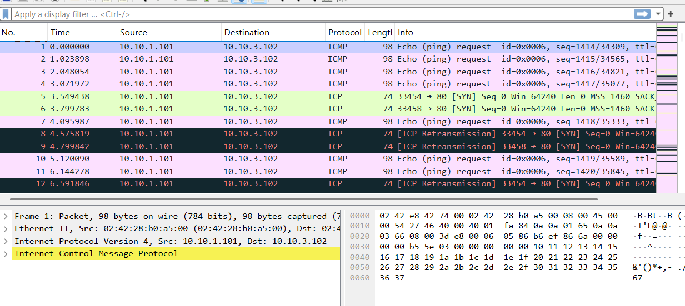
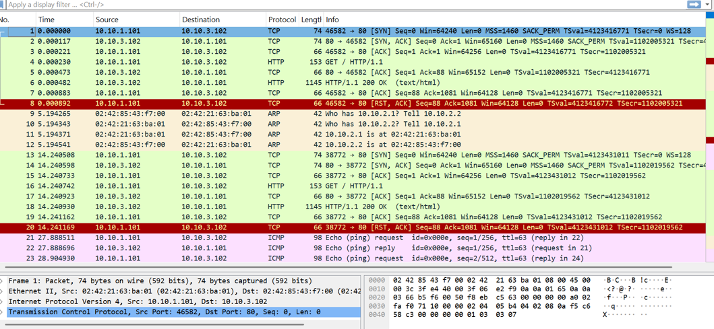
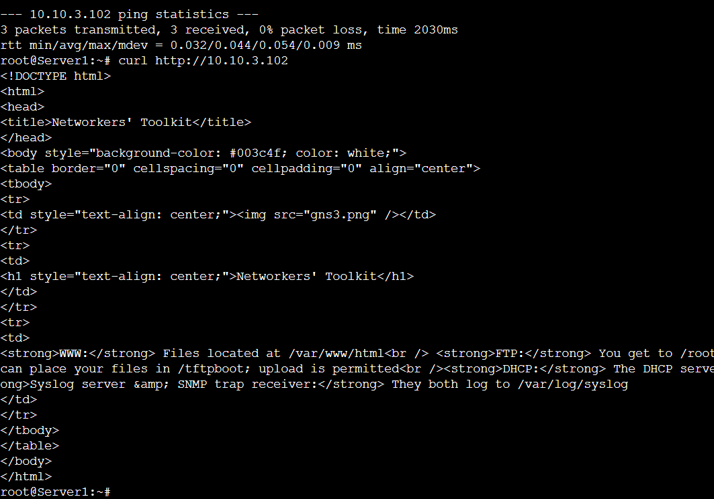
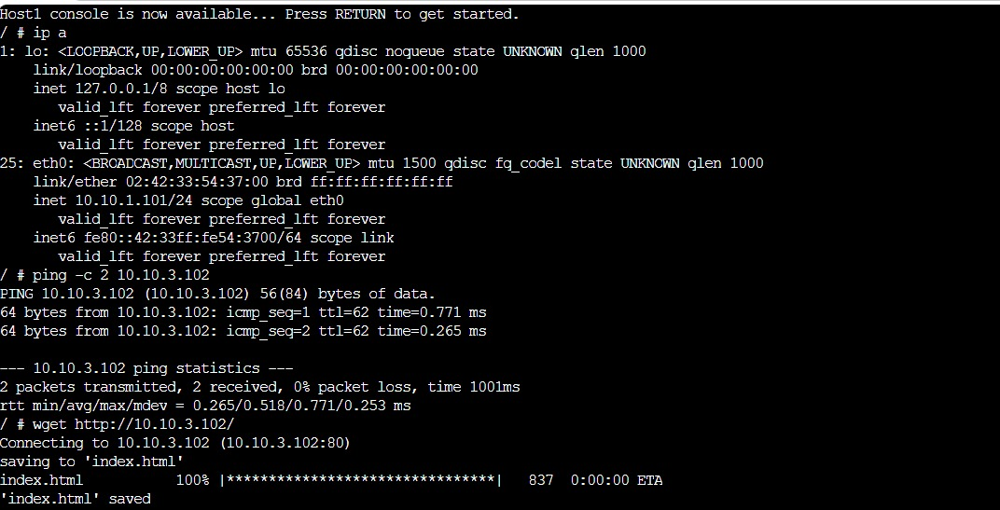

# COIT20261 Portfolio – Week 04

**Student Name:** Sandip Sapkota
**Student ID:** 12320934
**Unit:** COIT20261
**Week:** 04

---

# Objective

The objective of this week's tutorial was to understand HTTP communication using a graphical HTTP client and command-line HTTP clients. The activities were completed using GNS3, Firefox, Linux Host and Linux Server.

---

# Task 1 – HTTP Client with GUI

## Aim

The aim of this task was to use Firefox as an HTTP client to access a website hosted on a Linux Server and capture the HTTP traffic.

## Activities Completed

* Created the `HTTPClient-GUI-12320934` GNS3 project.
* Created three subnets: A, B and C.
* Connected the subnets using two routers.
* Configured static IP addresses and default gateways.
* Started all nodes and tested connectivity using `ping`.
* Started packet capture on the link between the two routers in Subnet B.
* Used the GNS3 VNC client to access Firefox.
* Used Firefox to access the website hosted on the Linux Server.
* Stopped and saved the packet capture.

---

# Task 2 – HTTP Client with Command Line Interface

## Aim

The aim of this task was to use `wget` and `curl` as command-line HTTP clients to access the Linux Server.

## Activities Completed

* Copied the GUI project to create `HTTPClient-CLI-12320934`.
* Replaced the Firefox Host with a Linux Host.
* Configured the Linux Host with the same IP address.
* Started all nodes and tested connectivity.
* Started packet capture on Subnet B.
* Used `wget` to access the Linux Server.
* Stopped and saved the packet capture.
* Used `curl` to access the Linux Server.

## Commands Used

### wget

```bash
wget http://<linux-server-ip>/
```

### curl

```bash
curl http://<linux-server-ip>/
```

---

# Learning Outcomes

After completing this week's tutorial, I can:

* Understand how HTTP clients communicate with HTTP servers.
* Use Firefox as a graphical HTTP client.
* Use `wget` and `curl` as command-line HTTP clients.
* Understand HTTP traffic travelling between different subnets.
* Capture HTTP traffic using packet capture.
* Understand the difference between GUI and command-line HTTP clients.

---
# Evidence












--- 
# Reflection

This week's tutorial helped me understand how HTTP communication works between a client and a web server across different networks. In Task 1, I used Firefox as a graphical HTTP client to access a website hosted on the Linux Server. I also captured the network traffic between the routers, which helped me understand how HTTP packets travel through the network.

In Task 2, I learned how to use command-line tools such as `wget` and `curl` to access the web server without using a graphical browser. `wget` was useful for downloading the webpage, while `curl` allowed me to view the server response directly in the terminal.

Overall, this tutorial improved my practical understanding of http clients, web servers, routing between subnets and packet capture. i also learned that wget and curl can be useful tools for testing and troubleshooting web services.

---
## GNS3 Project File

The  GNS3 project used for this tutorial is available below:

- [HTTPClient-CLI-12320934.gns3project](weekly_project_links/HTTPClient-CLI-12320934.gns3project)
- [HTTPClient-GUI-12320934.gns3project](weekly_project_links/HTTPClient-GUI-12320934.gns3project)
