# COIT20261 Portfolio – Week 05

**Student Name:** Sandip Sapkota  
**Student ID:** 12320934  
**Unit:** COIT20261  
**Week:** 05

---

# Week 05 Tutorial

## Objective

The objective of this week's tutorial was to understand routing tables, IP forwarding, communication between different subnets, and dynamic routing using OSPF. The practical activities were completed using GNS3 and Linux-based networking devices.

---

# Task 1 – View Routing Tables

## Aim

The aim of this task was to learn how to view routing tables and understand how IP forwarding allows a router to forward packets between different subnets.

## Network Setup

A GNS3 project named `View-Routes-12320934` was created. The network consisted of three Linux Host nodes, one Linux Router and one Ethernet switch.

The network was configured to contain two different IPv4 subnets. The Linux router was connected to both subnets so that it could forward packets between them.

## Activities Completed

The following activities were completed:

- Created the `View-Routes-12320934` GNS3 project.
- Added three Linux Host nodes.
- Added one Linux Router.
- Added one Ethernet switch.
- Connected the hosts and router to create two subnets.
- Configured static IP addresses for the hosts and router interfaces.
- Enabled IP forwarding on the router.
- Disabled IP forwarding on the hosts.
- Started all network nodes.
- Viewed the IP configuration of the devices.
- Viewed the routing tables of the hosts and router.
- Tested connectivity between hosts on different subnets using `ping`.

## IP Forwarding

IP forwarding was enabled on the Linux router because the router needs to forward packets between its connected subnets.

The forwarding status was checked using:

```bash
sysctl net.ipv4.ip_forward
```

A value of `1` indicates that IP forwarding is enabled, while a value of `0` indicates that IP forwarding is disabled.

The Linux hosts were configured with IP forwarding disabled because they were operating as end devices rather than routers.

## Routing Table

The routing table of each device was viewed using:

```bash
ip route show
```

The routing table contains information about directly connected networks and routes used to reach other networks.

The router used its routing information to forward packets between the two subnets.

## Connectivity Test

Connectivity between hosts on different subnets was tested using:

```bash
ping <destination-ip>
```

The successful ping demonstrated that the router was able to forward packets between the two subnets.

---

# Task 2 – Dynamic Routing with OSPF

## Aim

The aim of this task was to understand how dynamic routing works using OSPF and observe how the routing path changes when a network link becomes unavailable.

## Network Setup

The provided `OSPF-Basics-Template.gns3project` was imported and duplicated for the practical activity.

The template contained two hosts, four FRR routers and NETem nodes used to represent network links.

The IP addresses and OSPF configuration were already provided in the template.

## Activities Completed

The following activities were completed:

- Imported the OSPF template project.
- Duplicated the project for the tutorial.
- Started all nodes.
- Waited for the FRR routers to initialise.
- Accessed the FRR command interface.
- Viewed OSPF neighbour information.
- Viewed OSPF routing information.
- Viewed the routing tables of the routers.
- Used `traceroute` to identify the path between the hosts.
- Disconnected one of the available network paths by stopping the appropriate NETem node.
- Used `traceroute` again after the link failure.
- Observed the new path selected after the network change.

---

# FRR Commands Used

## View OSPF Neighbours

```text
show ip ospf neighbor
```

This command was used to identify the neighbouring routers connected to the FRR router.

## View OSPF Routes

```text
show ip ospf route
```

This command was used to view routes learned through OSPF.

## View Router Routing Table

```text
show ip route
```

This command was used to view the routing information used by the router.

## Trace the Network Path

```bash
traceroute <destination-ip>
```

The `traceroute` command was used to identify the routers through which packets travelled to reach the destination host.

---

# OSPF Routing

OSPF is a dynamic routing protocol that allows routers to exchange information about available networks.

The FRR routers in the provided topology were already configured to use OSPF. The routers exchanged routing information and maintained routes to networks that were not directly connected.

The routing information was observed using the FRR commands:

```text
show ip ospf neighbor
show ip ospf route
show ip route
```

The routing information obtained during the practical was recorded from the FRR routers.

---

# Traceroute Before Link Failure

The first `traceroute` test was performed before disconnecting a network link.

This showed the path selected by OSPF between the source and destination hosts.

The traceroute output provided information about the intermediate routers and the path used to reach the destination.

---

# Link Failure and Route Change

One of the NETem nodes on the currently used path was stopped to simulate a network link failure.

After the link was disconnected, the original path was no longer available.

The `traceroute` command was then run again to observe the new path.

OSPF detected the change in network availability and updated the routing information so that traffic could use an alternative available path.

This demonstrated the ability of dynamic routing to adapt to changes in the network topology.

---

# Evidence

## Task 1 – View Routing Tables

### Screenshot 1 – View-Routes Network

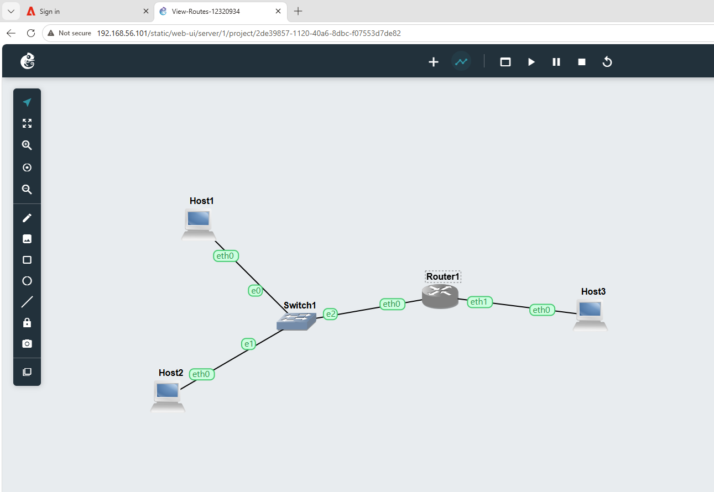

### Screenshot 2 – IP Address Configuration
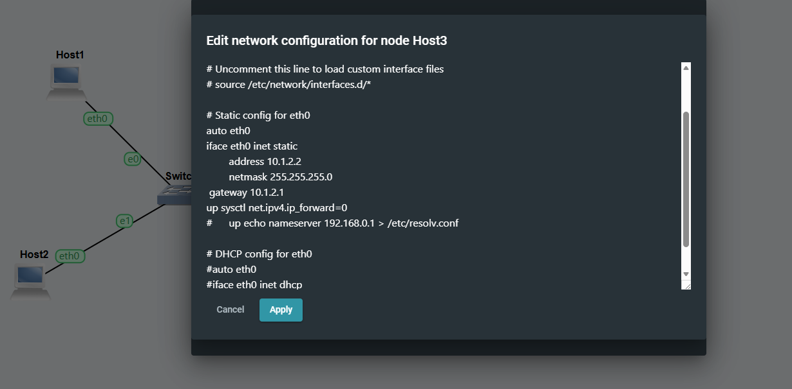

### Screenshot 3 – IP Forwarding Status

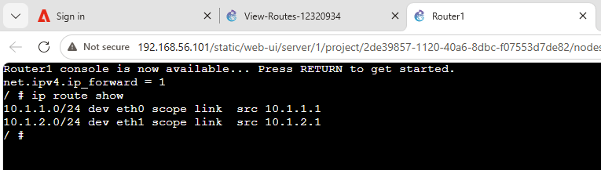

### Screenshot 4 – Ping Connection
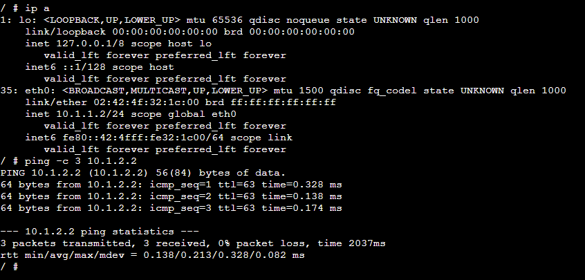

### Screenshot 5 – Successful Ping Between Subnets
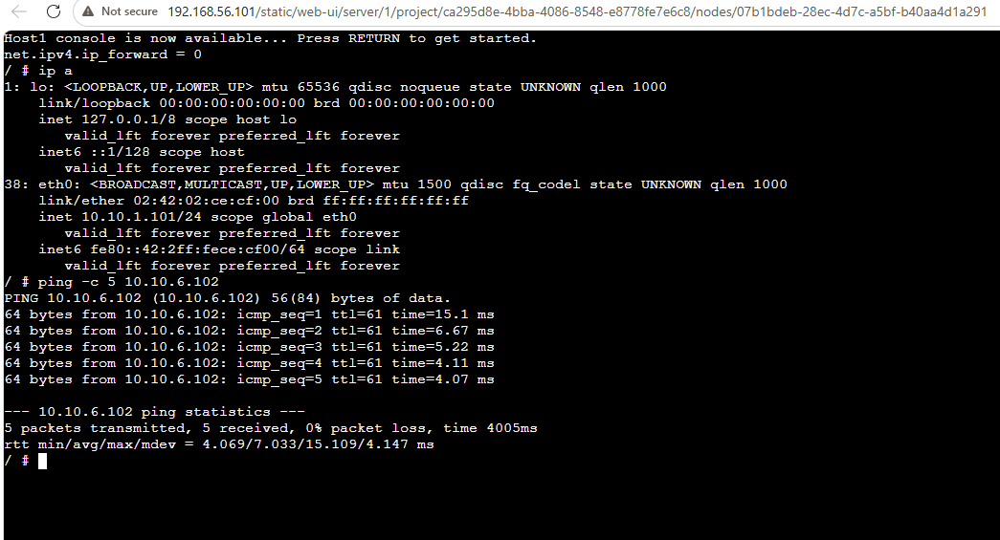

---

## Task 2 – OSPF Dynamic Routing

### Screenshot 6 – OSPF Network
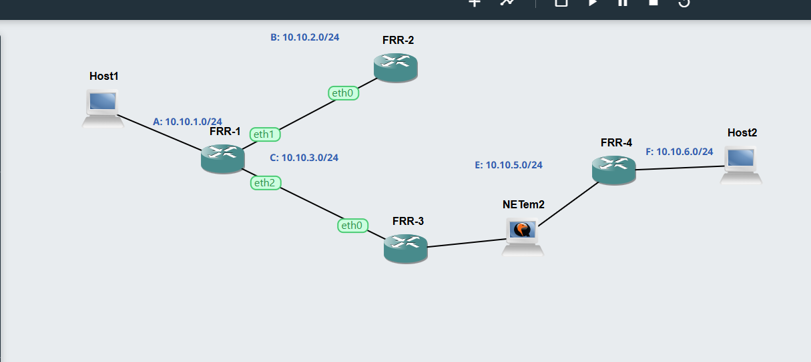

### Screenshot 7 – OSPF Neighbour Information
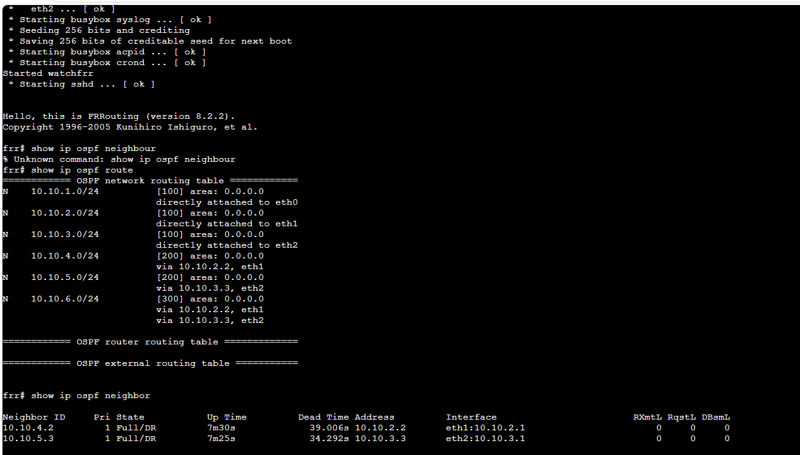

### Screenshot 8 – OSPF Routing Information
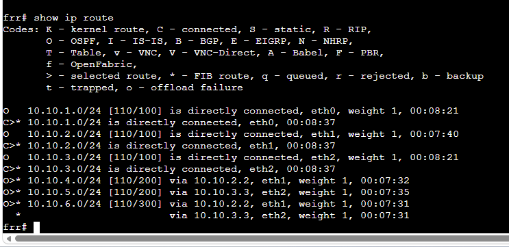

### Screenshot 10 – Traceroute Before Link Failure and Routing Table
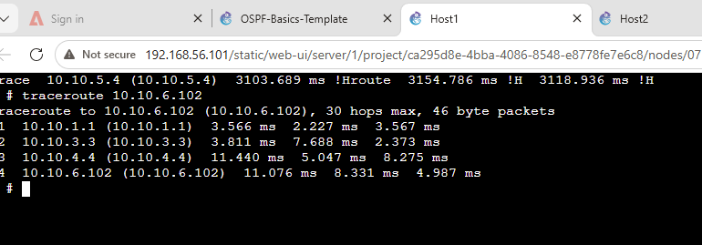

### Screenshot 11 – Network Link Failure
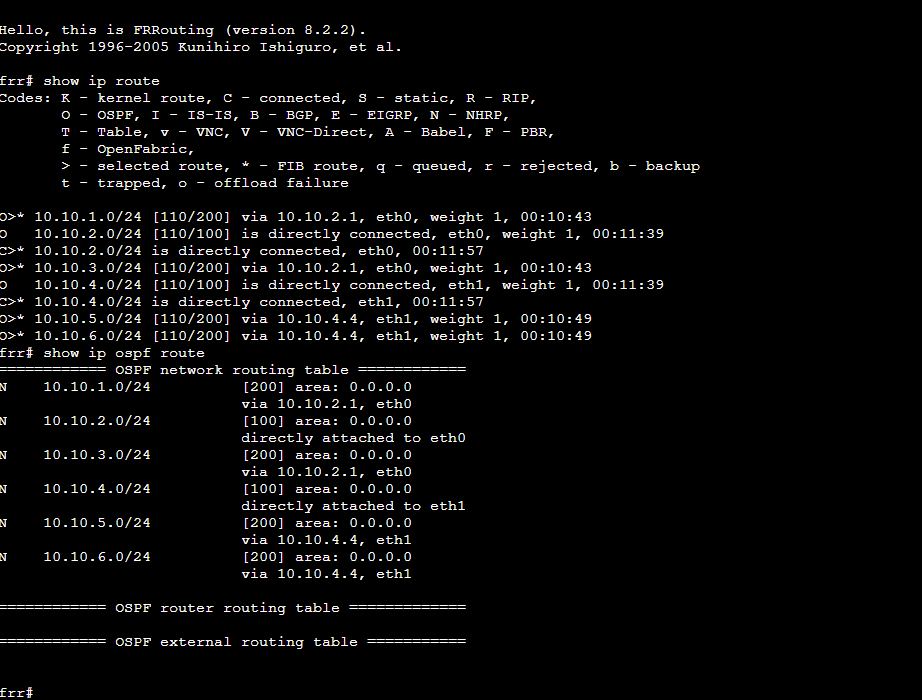

### Screenshot 12 – Traceroute After Link Failure
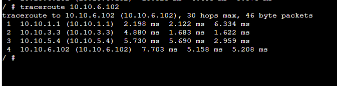

---

# Testing Results

| Test | Result |
|---|---|
| Static IP addresses configured | Pass |
| Router IP forwarding enabled | Pass |
| Host IP forwarding disabled | Pass |
| Routing tables displayed | Pass |
| Communication between different subnets tested | Pass |
| Ping between different subnets successful | Pass |
| FRR routers started successfully | Pass |
| OSPF neighbour information displayed | Pass |
| OSPF routing information displayed | Pass |
| Router routing tables displayed | Pass |
| Traceroute before link failure completed | Pass |
| Network link successfully disconnected | Pass |
| Traceroute after link failure completed | Pass |
| Alternative routing path observed | Pass |

---

# Learning Outcomes

After completing this week's tutorial, I can:

- Configure and check IP addressing on Linux networking devices.
- Understand the purpose of IP forwarding.
- Distinguish between a Linux host and a router.
- View Linux routing tables using `ip route show`.
- Test connectivity between different subnets using `ping`.
- View OSPF neighbour information.
- View OSPF routes using FRR commands.
- View the routing table of an FRR router.
- Use `traceroute` to identify the path taken by network traffic.
- Understand how OSPF responds to network topology changes.
- Understand the difference between static routing and dynamic routing.

---
## GNS3 Project File

The OSPF GNS3 project used for this tutorial is available below:

[OSPF-Basics-Template.gns3project](weekly_project_links/OSPF-Basics-Template.gns3project)

# Reflection

This week's tutorial improved my practical understanding of routing and how packets are forwarded between different networks. In Task 1, I learned that a router requires IP forwarding to be enabled so that it can forward packets between different subnets. I also learned how to use `ip route show` to view the routing table and understand the routes available to a Linux device.

The second task helped me understand dynamic routing using OSPF. I learned how OSPF routers exchange routing information and maintain routes to networks that are not directly connected. The FRR commands allowed me to view neighbouring routers, OSPF routes and the complete routing table.

Using `traceroute` was particularly useful because it allowed me to see the actual path taken by packets through the network. After stopping a NETem node, the original path became unavailable and the routing path changed. This helped me understand how dynamic routing protocols can respond to network failures and maintain communication using an alternative path.

Overall, the practical activities gave me a better understanding of routing tables, IP forwarding, routers, OSPF and network path changes. I also became more confident using Linux networking commands and the GNS3 environment. These skills will be useful for troubleshooting and analysing network communication in future networking and cybersecurity activities.
